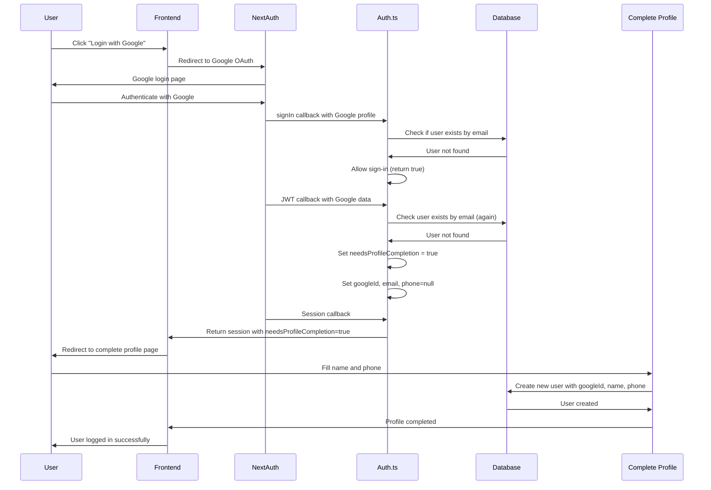
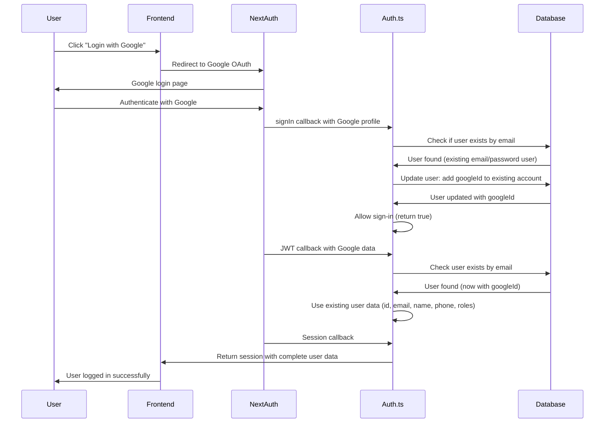
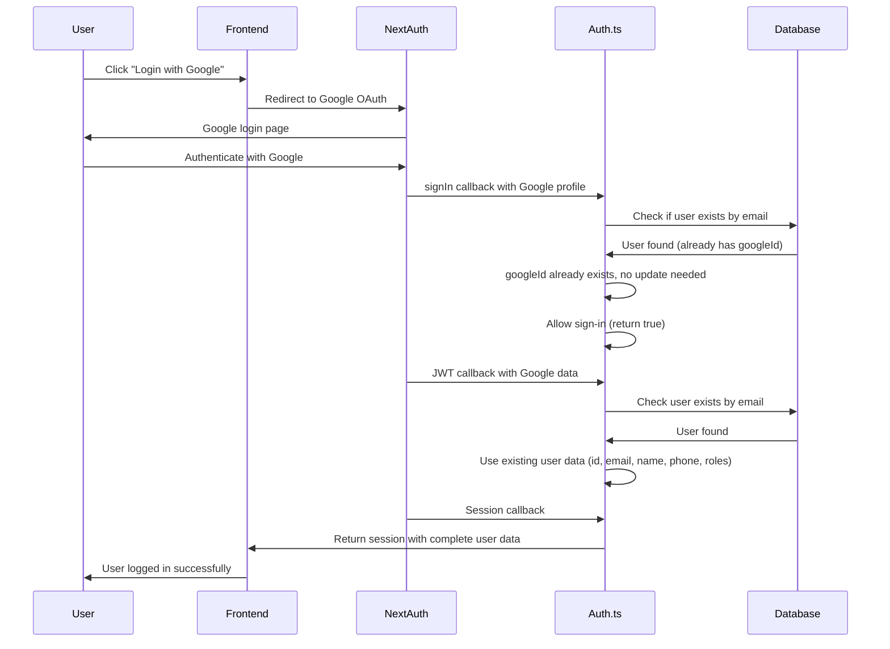

# Google Authentication Flow Documentation

## 🔄 Complete Google Login Flow

This document explains the complete Google authentication flow for all three user scenarios in our game rental system.

### **Flow 1: New User (First Time Google Login)**



**Key Points:**
- Phone is required but Google doesn't provide it
- User MUST complete profile before accessing system

---

### **Flow 2: Existing User WITHOUT Google ID (Email/Password User)**



**Key Points:**
- Existing user's data is preserved (name, phone, etc.)
- Google account is automatically linked to existing account
- No profile completion needed
- User can now login with either email/password OR Google

---

### **Flow 3: Existing Google User (Already Has Google ID)**



**Key Points:**
- Fastest flow - user already exists with Google ID
- No database updates needed
- Direct login with existing profile data

---

## 🔍 Code Implementation Details

### **In `src/lib/auth.ts`:**

```typescript
// signIn callback - handles account linking
async signIn({ user, account, profile }) {
  if (account?.provider === 'google') {
    const existingUser = await prisma.user.findUnique({
      where: { email: user.email! },
    });

    if (existingUser) {
      // Flow 2 & 3: Link Google if not already linked
      if (!existingUser.googleId) {
        await prisma.user.update({
          where: { id: existingUser.id },
          data: { googleId: account.providerAccountId },
        });
      }
      return true;
    } else {
      // Flow 1: New user - will need profile completion
      return true;
    }
  }
  return true;
}

// JWT callback - handles session data
async jwt({ token, user, account, profile }) {
  if (account?.provider === 'google') {
    const existingUser = await prisma.user.findUnique({
      where: { email: token.email! },
    });

    if (existingUser) {
      // Flow 2 & 3: Use existing user data
      token.id = existingUser.id;
      token.email = existingUser.email;
      token.name = existingUser.name;
      token.roles = existingUser.roles;
    } else {
      // Flow 1: New user needs profile completion
      token.needsProfileCompletion = true;
      token.googleId = account.providerAccountId;
      token.email = token.email;
      token.name = null;  // Don't trust Google's name
      token.phone = null; // Google doesn't provide phone
    }
  }
  return token;
}
```

### **Profile Completion Endpoint:**
- **URL**: `/api/auth/complete-google-profile`
- **Required**: `googleId`, `name`, `email`, `phone`
- **Creates**: New user with all required fields
- **Used by**: Flow 1 (new users only)

## 🎯 Summary

| Scenario | Database Action | Profile Completion | Login Result |
|----------|----------------|-------------------|--------------|
| **New User** | Create new user | ✅ Required | Complete profile → Login |
| **Existing User (no Google)** | Add googleId to existing | ❌ Not needed | Instant login |
| **Existing Google User** | No change | ❌ Not needed | Instant login |

## 🔒 Security & UX Considerations

### **Security:**
1. **Phone Validation**: All users must provide phone numbers (Google doesn't provide them)
2. **Name Verification**: Google's name data is not trusted - users must provide their own
3. **Email Verification**: Uses Google's verified email but requires manual profile completion

### **User Experience:**
1. **Existing Users**: Seamless login after automatic Google account linking
2. **New Users**: One-time profile completion with clear requirements
3. **Flexibility**: Users can login with either email/password or Google after linking

### **Data Integrity:**
- User-provided data is prioritized over Google's profile data
- Phone numbers are always required and manually entered
- Profile completion is mandatory for new Google users

## 🚀 Implementation Files

### **Key Files:**
- `src/lib/auth.ts` - NextAuth configuration with Google OAuth
- `src/app/api/auth/complete-google-profile/route.ts` - Profile completion endpoint
- `src/lib/validations.ts` - Validation schemas for Google auth
- `openapi/auth/` - API documentation for Google authentication

### **User Stories:**
- **US-1.7**: User Registration Options (supports both email/password and Google OAuth)
- Requirement: Google registration always requires manual name and phone entry
- Requirement: Existing users can link Google accounts to their existing accounts

The flow ensures that:
1. **Security**: Phone numbers are always required and manually entered
2. **User Experience**: Existing users get instant login after Google linking
3. **Data Integrity**: Google's name data is not trusted, user provides their own
4. **Flexibility**: Users can login with either method after linking